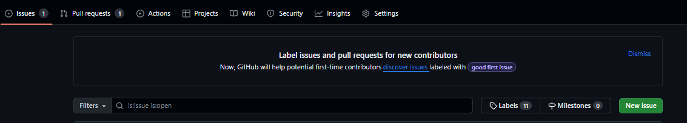
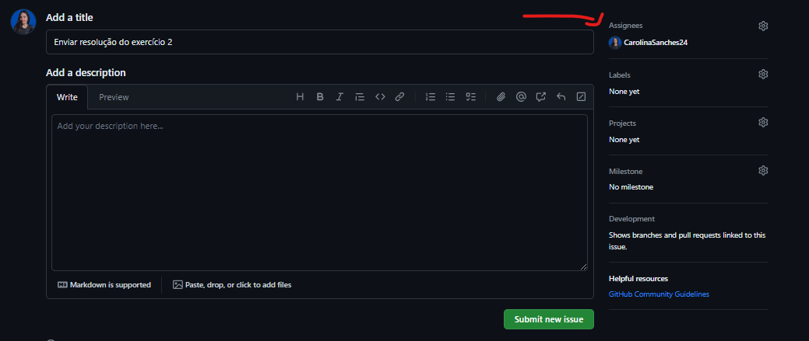
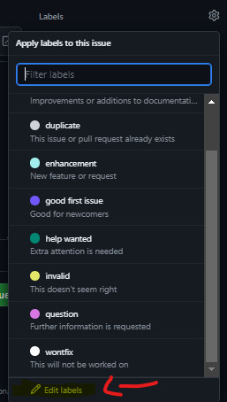
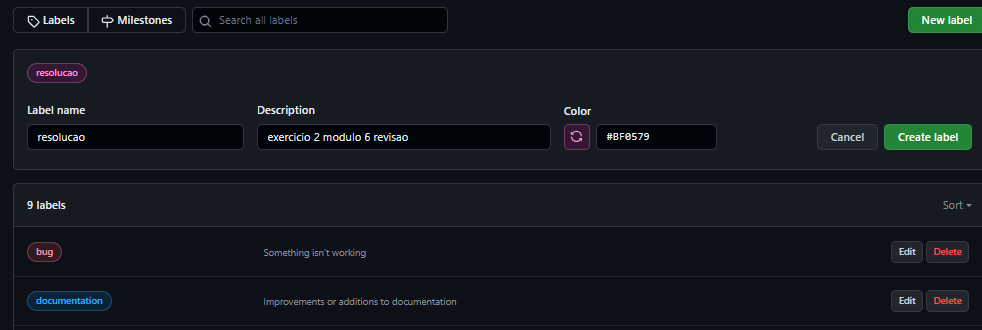
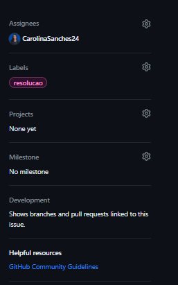
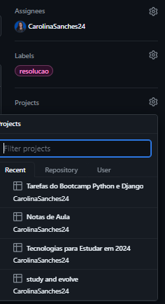
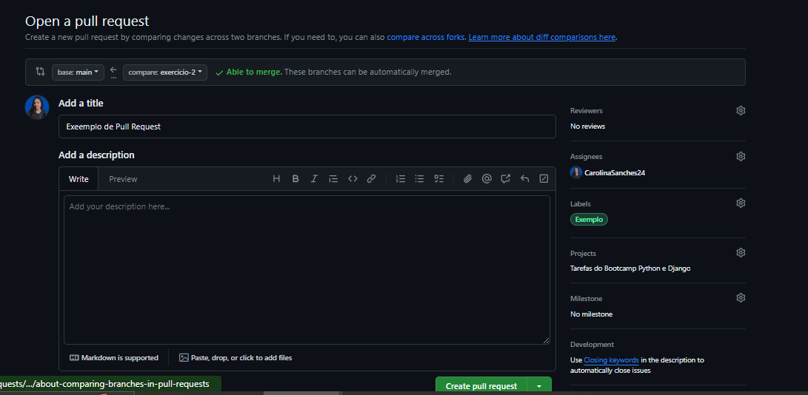
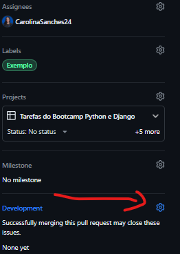

# Revisão de Git

Inicializando Repositorio git

```bash
git init
```

Para visualizar os repositórios remotos, utilize o comando:

```bash
git remote -v
```

Saída:

```bash
origin  https://github.com/usuario/repositorio.git (fetch)
origin  https://github.com/usuario/repositorio.git (push)
```

Adicionando e Commitando Alterações
Adicione as alterações ao staged area com o comando:

```bash
git add nome_do_arquivo
```

ou para adicionar todas as alterações:

```bash
git add .
```

Em seguida, efetue o commit das alterações utilizando:

```bash
git commit -m "Mensagem do commit"
```

Clonando um repositório

```bash
git clone https://github.com/example/repository.git
```

Criando uma nova branch

```bash
git checkout -b [nome_da_branch]
```

Verificando arquivos modificados

```bash
git status
```

<details>
  <summary>Atribuindo Issue a um projeto</summary>
  
 Criando um issue
  


Personalizando label
 <br><br>
<br><br>
<br><br>
<br><br>

</details>
<details>
  <summary>Fazendo um pull request</summary>
  
  - Clicar no link gerado no terminal
  
- Faça as mesmas configurações que foram feitas no issue
- Clique em Create pull request
- Vincular issue
  

</details>

Enviando as alterações locais para um repositório remoto.

```bash
git push
```

Criando uma nova branch local e deseja empurrá-la para o repositório remoto pela primeira vez

```bash
git push --set-upstream origin [NOME_DO_BRANCH_LOCAL]
```

O comando git pull é usado para buscar e mesclar alterações de um repositório remoto para o seu repositório local. Basicamente, ele é uma combinação de dois comandos Git separados: git fetch e git merge.

Fetch: Isso recupera as últimas alterações do repositório remoto sem mesclá-las no seu diretório de trabalho.

```bash
git fetch
```

Merge: Isso combina as alterações recuperadas do repositório remoto com o seu branch local atual.

```bash
git merge origin/nome_do_seu_branch
```

O comando git pull realiza tanto o fetch quanto o merge em uma única etapa, sendo um atalho conveniente:

```bash
git pull origin nome_do_branch
```
